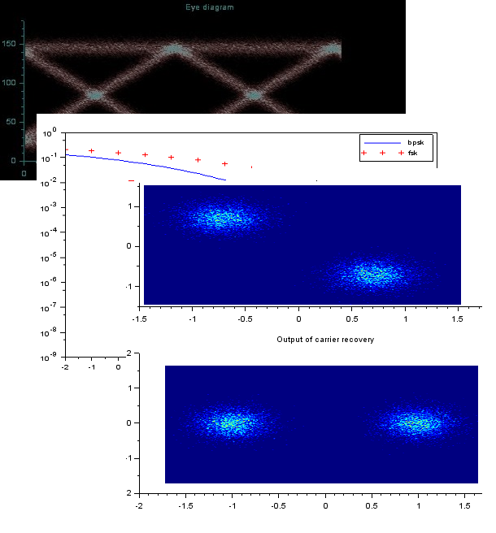

# Scilab communication toolbox
A SCILAB toobox for Software Defined Radio (rf signal modulation / demodulation algorithms). The official web page is [TSD Conseil / Scilab Communication Toolbox](http://www.tsdconseil.fr/log/sct/index-en.html). Especially, the full documentation is available there at [http://www.tsdconseil.fr/log/sct/api/index-en.html](http://www.tsdconseil.fr/log/sct/api/index-en.html).

The project is written in [SCILAB](http://www.scilab.org) (version 5.4.2), an open source computing software (similar to Matlab).

## Contributing

Contributions are welcome! 

## Author
(C) J.A. / http://www.tsdconseil.fr 

## License
The software is provided according to the CeCILL-C license version 2.1 (open source software). Please see [license.txt](license.txt).
